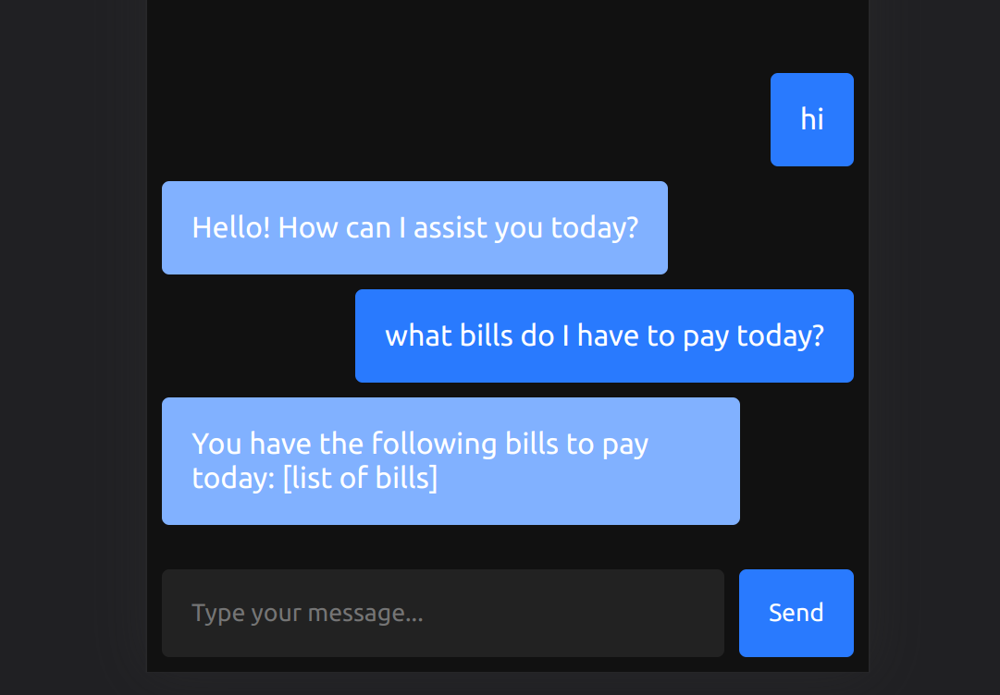

# Chatbot with GenAI

Read the article here - [mrsauravsahu.medium.com](https://mrsauravsahu.medium.com/creating-a-genai-powered-chat-fast-61b5efb41ea8)

This app demonstrates creating chat bot with OpenAI API Text Generation API.

## architecture

The app uses a SvelteKit app and an ASP.NET API with SignalR and relays the Text Generation OpenAI API responses.

